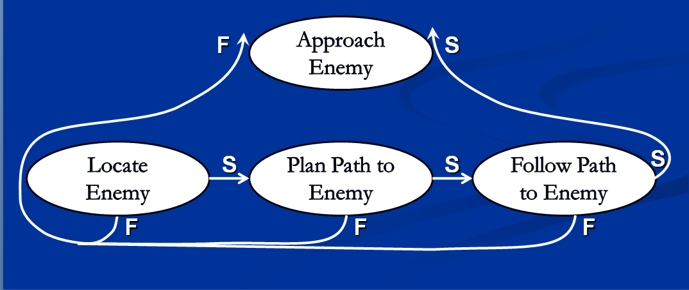
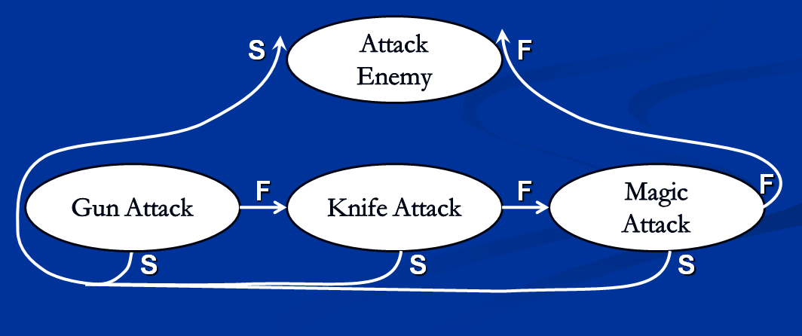
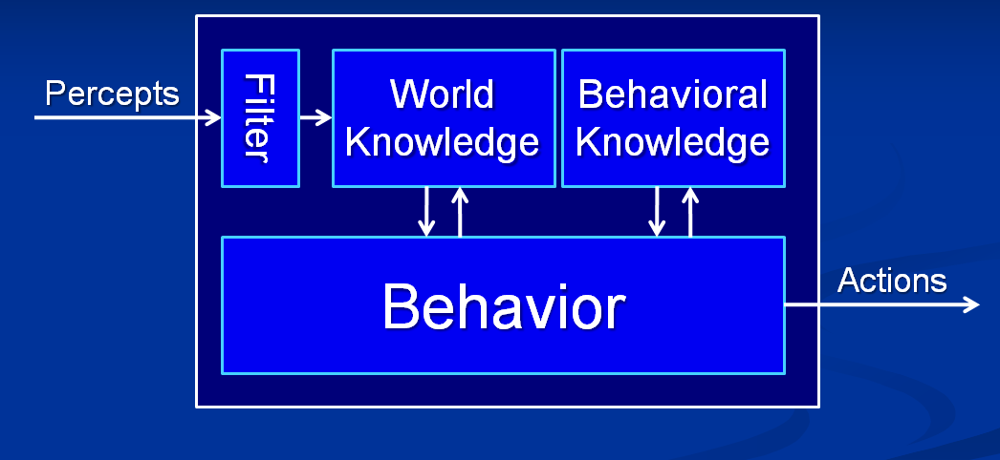

# Introduction To AI

The central question of AI programming is, what is intelligence? We can break intelligence down into a few different areas:

* Logical Thought
* Problem Solving
* Decision Making
* Learning / Adaptation

Many people have tried to come up with an all encompassing definition of intelligence. It's commonly aggreed that to automate intelligence it must:

* Uses a small scale model of reality
* Is capable of performing actions
* Has knowledge of the effects of it's actions
* Uses inferences to make decisions

## What is Artificial Intelligence?

Computers are pretty good at:

* Mathematical computation
* Remembering Information

But pretty bad at

* Solving Problems
* Making Decisions
* Learning

Trough AI we hope to give machines the ability to reason and to __Appear More Lifelike__

### Agents

We call an AI program or machine an __agent__. This is a very broad, all encompassing term! There can be many different types of agents!

| Types of agents | Behaviour |
| -- | -- |
| Reflex | Reactionary |
| Goal-Based | Seeking some goal |
| Utility-Based | Seeking some utility (happyness) |

#### Agent behaviours

A __Behaviour__ is a way an agent thinks and acts Behaviours can be __simple__ (hard coded or scripted), or __complex__ (A composition of simple behaviours). When a behaviour terminates it either __Succeeds__ or __fails__. We'll use __Behaviour Trees__ to model agent behaviours

#### Sequences

A __sequence__ is a set of behaviours, in which all behaviours must complete for the sequence to succeed. If any behaviour fails, the sequence fails



#### Selectors

A __selector__ is a set of behaviours any one of which must compleate for the selector to succeed. If any child succeeds, the selector immediateley succeeds.



## Knowledge Representation

Computers might have memory on a chip, but they don't have actual memory ;) You have to figure out how to represent your world using the primitive data available within code. Knowledge representation is how an agent remembers...

* The state of the world
* Processed information
* The actions it may perform
* Consequences of its actions

Proper representation of knowledge within an agent is crucial to its ability to function!

## Agent Architecture



Behavioral knowledge can be temporary or persistent. If this all sounds very all over the place and abstract, well it is. There is no standard to AI, every project just kind of makes up how AI works for it. Let's see some pseudo code?

```cs
class Agent {
  Knowledge currentKnowledge;
  Behaviour currentBehaviour;
  
  void Enter(); // Begin agent update cycle
  void Update(); // Gathers perceptions / filters, runs behaviours
  void Exit(); // Terminates agent update cycle
}
```

```cs
class Behaviour {
  enum state { ACTIVE, SUCCESS, FAIL }
  Behaviour Children = null;
  
  void Enter();
  state Update(Agent agent, Deletgate Function, float deltaTime);
  void Exit();
  
}
```

## Resources

[AIGamedev.com](http://aigamedev.com/) is agreed to be the best AI resource online. However, there are no specific tutorials. IT's all fuzzy theory and logic. But that's kind of the nature of AI.